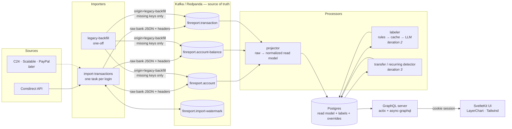
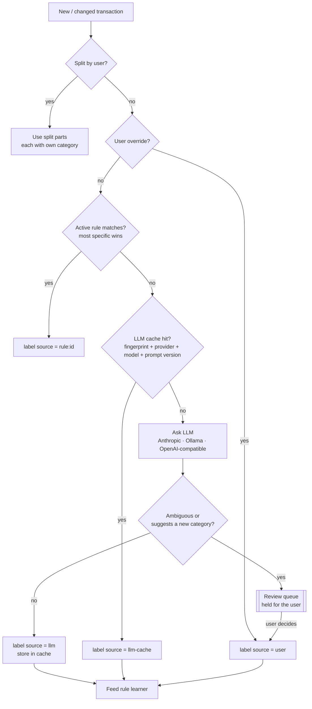
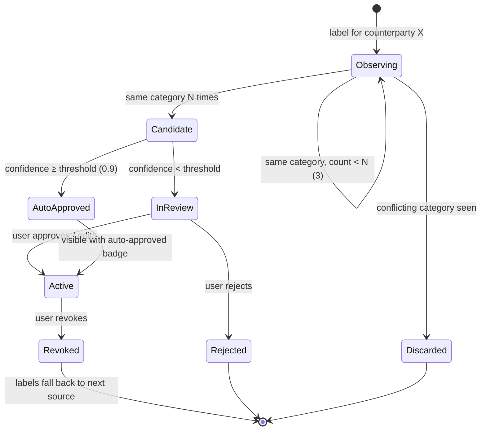
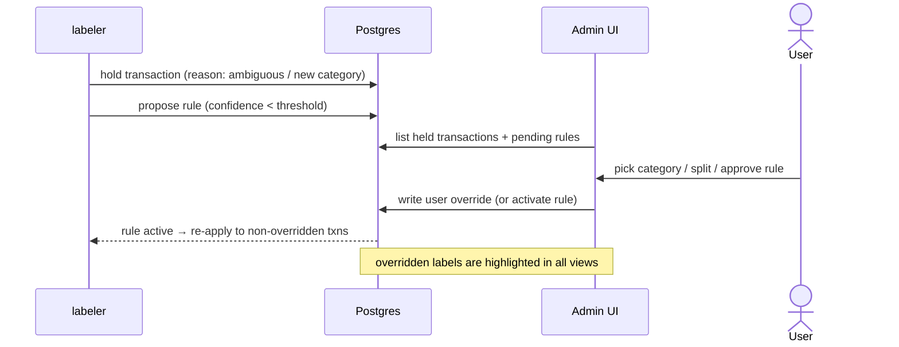

# finreport — how it works

Diagrams of the target design. Iteration 1 builds the import → Kafka → projector → GraphQL → UI path. The labeling machinery (rules, LLM, review) arrives in iteration 2. See `docs/specs/` for the details of each iteration and `docs/requirements.md` for the decisions behind them.

## 1. Data flow

**Notes and edge cases**
- The importer writes only to Kafka. Postgres is a read model and can always be rebuilt by replaying from offset 0.
- Raw bank records and replayed legacy records share the same topics and keys. Raw always wins, whichever arrives first.
- Processors work on the **normalized** transaction, never on a bank's raw JSON, so replayed legacy data gets the same enrichment as live data.
- Your labels and overrides live in separate tables, so a replay never overwrites them.

## 2. How a transaction gets its category

**Notes and edge cases**
- The LLM is only called when no override, rule or cache entry applies. Repeated merchants like Lidl stop costing anything once they have a rule.
- A held transaction keeps no category until you decide. It isn't counted as uncategorized spending in the meantime: it shows up as "needs review".
- The UI highlights each label by its source, so you can see at a glance whether you, a rule, the cache or the LLM set it.

## 3. Learned rule lifecycle

**Notes and edge cases**
- A candidate's confidence is the **minimum** of its underlying LLM confidences, and a label you confirmed counts as 1.0. One shaky label is enough to stop automatic approval.
- A rule never overrides a user override or a split.
- Re-applying a changed rule to past transactions is idempotent and only touches labels the rule itself set.

## 4. Review flow (admin UI)

