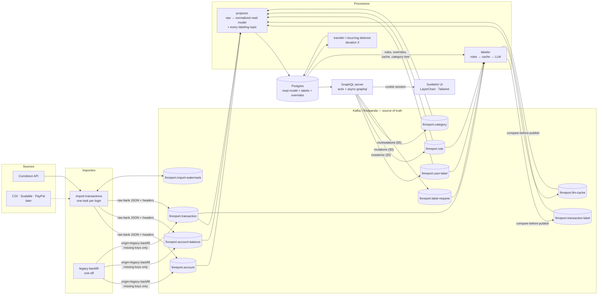
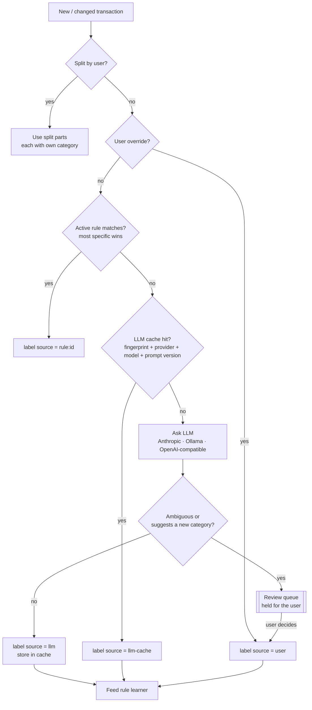
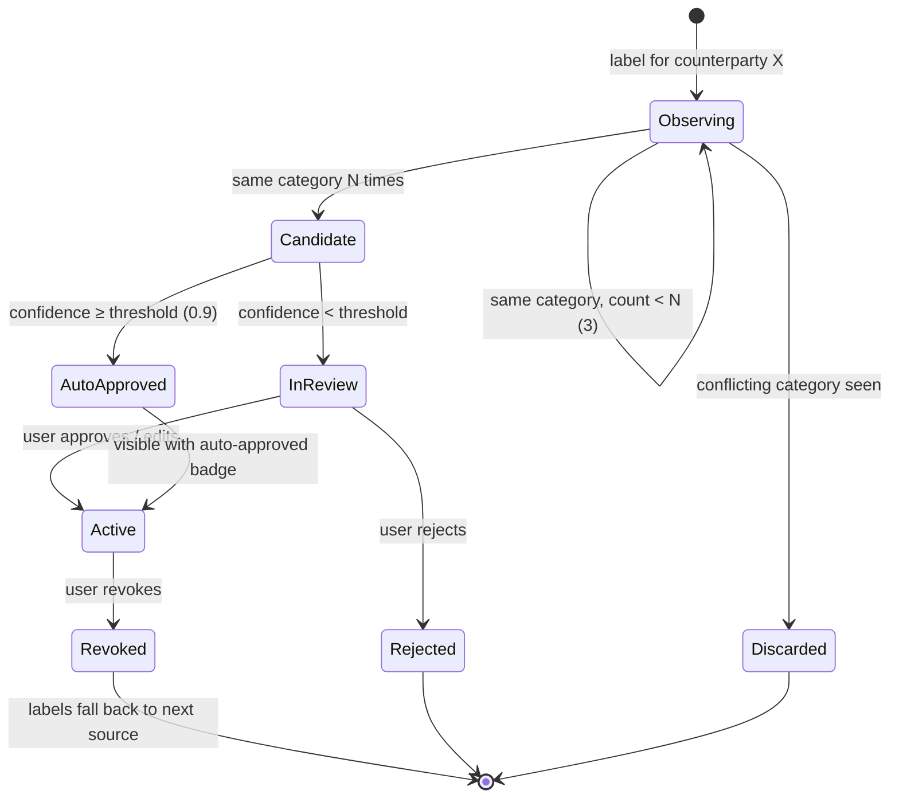
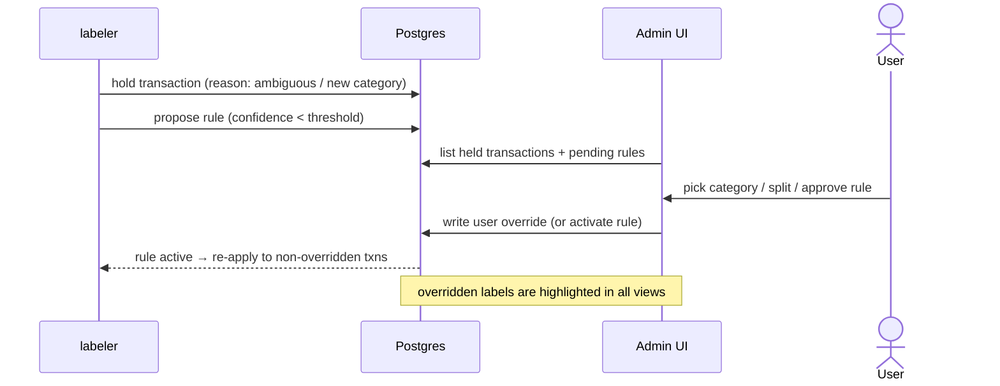

# finreport — how it works

Diagrams of the target design. Iteration 1 built the import → Kafka → projector → GraphQL → UI path; iteration 2 added the labeling pipeline (rules, LLM, review) below. See `docs/specs/` for the details of each iteration and `docs/requirements.md` for the decisions behind them.

## 1. Data flow

**Notes and edge cases**
- The importer writes only to Kafka. Postgres is a read model and can always be rebuilt by replaying from offset 0.
- Raw bank records and replayed legacy records share the same topics and keys. Raw always wins, whichever arrives first.
- Processors work on the **normalized** transaction, never on a bank's raw JSON, so replayed legacy data gets the same enrichment as live data.
- Your labels and overrides live in separate tables, so a replay never overwrites them.
- The labeler never writes Postgres directly: it publishes label/cache records to Kafka, and the projector — same process as the iteration-1 topics, one more dispatch entry — is what actually projects them. This keeps "Postgres is always rebuildable from the log" true for labels too.
- Compare-before-publish (docs/specs/iteration-2.md §2.3): the labeler republishes only when an *input* changed (a new override, a rule win/loss, a changed fingerprint), not merely because the recomputed record differs textually from the stored one — otherwise every replay would rewrite the whole `transaction-label` topic.

## 2. How a transaction gets its category

**Notes and edge cases**
- The LLM is only called when no override, rule or cache entry applies. Repeated merchants like Lidl stop costing anything once they have a rule.
- A held transaction keeps no category until you decide. It isn't counted as uncategorized spending in the meantime: it shows up as "needs review".
- The UI highlights each label by its source, so you can see at a glance whether you, a rule, the cache or the LLM set it.

## 3. Learned rule lifecycle

**Notes and edge cases**
- A candidate's confidence is the **minimum** of its underlying LLM confidences, and a label you confirmed counts as 1.0. One shaky label is enough to stop automatic approval.
- A rule never overrides a user override or a split.
- Re-applying a changed rule to past transactions is idempotent and only touches labels the rule itself set.

## 4. Review flow (admin UI)

## 5. Dev stack & deploy topology (iteration 2)

| Topic | Cleanup | `prevent_destroy` |
|---|---|---|
| `finreport.account`, `.account-balance`, `.transaction`, `.import-watermark` | iteration 1 (unchanged) | yes |
| `finreport.transaction-label`, `.llm-cache`, `.user-label`, `.rule`, `.category` | compact | yes |
| `finreport.label-request` | delete, 7 d | **no** — a work queue, replaceable by design |

- **Local** (`docker-compose.local.yml`): `finreport-redpanda-init` creates every topic above on the single-node Redpanda; `just dev-labeler`/`seed-categories` run the new binaries as plain `cargo run`, same as `dev-projector`. An optional `finreport-ollama` Compose profile (off by default) is available for testing a real small model without an Anthropic key.
- **Deployed** (`docker-compose.yml`): a new `finreport-be-labeler` service joins `finreport-be-projector` — same prebuilt image, same central broker, static LAN IP `192.168.100.49`, no new port. `APP_anthropic_api_key` flows from 1Password (`.env.tpl`'s `TF_VAR_anthropic_api_key`) through `terraform/variables.tf`; see the "Anthropic key wiring" note in `CLAUDE.md` for the one open gap in that chain.
- **`just dev-demo`** reaches a populated review queue and a learned rule by alternating `projector --until-caught-up` and `labeler --until-caught-up` until a round changes nothing (max 5 rounds) — a single pass can't work, because categories are only *published*, not yet *projected*, when the labeler would first need them. See the recipe's own comment in `justfile` for the round-by-round reasoning.
- **Shared `CARGO_TARGET_DIR`**: every worktree and the main checkout build into one directory (`finreport-worktrees/.cargo-target`), exported by the `justfile`; see "Shared `CARGO_TARGET_DIR`" in `CLAUDE.md`.
